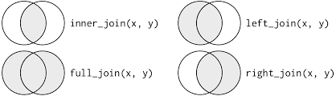

# Recap

# Block 4: Organizing Data

## Daten einlesen und notwendige Packages laden
Zuerst laden wir alle notwendigen Packages und laden unsere Daten - genau wie beim letzten Mal:

```{r}
source("../code/packages.R")

columns <- c("Schluessel", "Straftat", "Gemeindeschluessel", "Stadt_Landkreis", "Kreisart", "erfasste_Faelle_Anzahl", "erfasste_Faelle_Prozent", "ef_Versuche_Anzahl", "ef_Versuche_Prozent", "Schusswaffe_gedroht", "Schusswaffe_geschossen", "Aufklaerung_Anzahl", "Aufklaerungsquote", "TV_insgesamt", "TV_maennlich", "TV_weiblich", "nd_TV_Anzahl", "nd_TV_Anteil", "Sort", "leer","GemSchl", "Gem", "EW")

BKA_preprocessed <- readxl::read_excel("../data/KR-F-01-T01-Kreise-Faelle-HZ_xls (1).xlsx", 
                                       col_names = columns, skip = 9)
```
 
## dplyr::select
Welche Variablen haben wir im Datensatz?

```{r}
BKA_preprocessed %>% names()
```

Davon wollen wir aber nur mit folgenden Variablen weiterarbeiten. Dabei hilft `dplyr::select`: 

- Straftat
- Gemeindeschluessel
- Stadt_Landkreis
- erfasste_Faelle_Anzahl
- Aufklaerung_Anzahl

```{r}
BKA_reduced <- BKA_preprocessed %>%
  dplyr::select(
    Straftat = Straftat,
    Gemeindeschluessel = Gemeindeschluessel,
    Stadt_Landkreis = Stadt_Landkreis,
    Anzahl_Faelle = erfasste_Faelle_Anzahl,
    Anzahl_Aufklaerung = Aufklaerung_Anzahl
  )
BKA_reduced
```

Mit `dplyr::select` kann auch eine Range an Variablen ausgewählt werden oder Variablen, die nach einem gewissen Muster benannt sind. Mit & und | können verschiedene Operatoren kombiniert werden.

```{r}
BKA_preprocessed %>%
  dplyr::select(
    Straftat:Kreisart
  )

BKA_preprocessed %>%
  dplyr::select(
    !(Straftat:Kreisart)
  )

BKA_preprocessed %>%
  dplyr::select(
    Gemeindeschluessel,
    Stadt_Landkreis,
    starts_with("erfasste")
  )
```

## dplyr::filter

## dplyr::arrange

## Merge datasets (dplyr::?_join)
Es gibt mehrere Arten, zwei Datensätze miteinander zu verknüpfen:
```{r, out.width="100%",echo=FALSE,fig.align="center",out.width="50%"}

```
https://d33wubrfki0l68.cloudfront.net/aeab386461820b029b7e7606ccff1286f623bae1/ef0d4/diagrams/join-venn.png


Um unseren Datensatz mit einem anderen Datensatz zu verknüpfen, laden wir einen weiteren Datensatz:

```{r}
#BKA_other
```

In R heißen die Funktionen genauso:

```{r}
#dplyr::inner_join()
#dplyr::full_join()
#dplyr::left_join()
#dplyr::right_join()
```

Es gibt noch weitere joins, um Datensätze miteinander zu verknüpfen (`dplyr::semi_join`, `dplyr::anti_join`, `dplyr::nest_join`; https://dplyr.tidyverse.org/reference/join.html)

# Block 5: Data Manipulation


# Block 6: Hands-On Session

